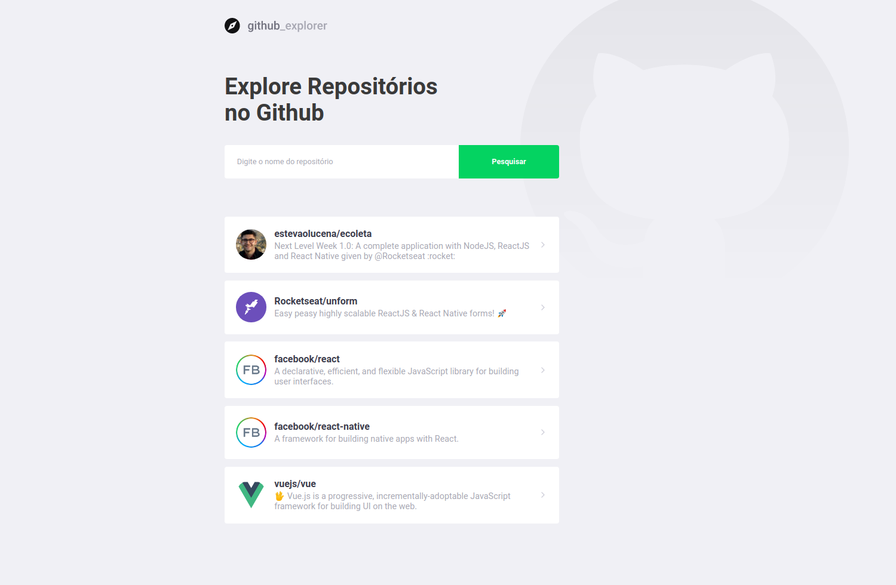
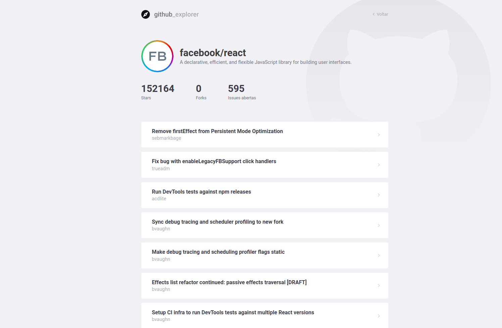

<h1 align="center">
    
</h1>

# :ledger: Week 03 - Github Explorer

## :rocket: Technologies
This project was developed with the following technologies:
- Yarn
- ReactJS

## :art: Web example:



## :runner: Running

```bash
# Clone the classes repository
git clone https://github.com/estevaolucena/gostack-classes.git

# Acess this project directory
cd semana03/primeiro-projeto-react

# Run
yarn start
```

Made with ♥ by Estevão Lucena :wave: [Get in touch!](https://www.linkedin.com/in/estevaolucena/)
